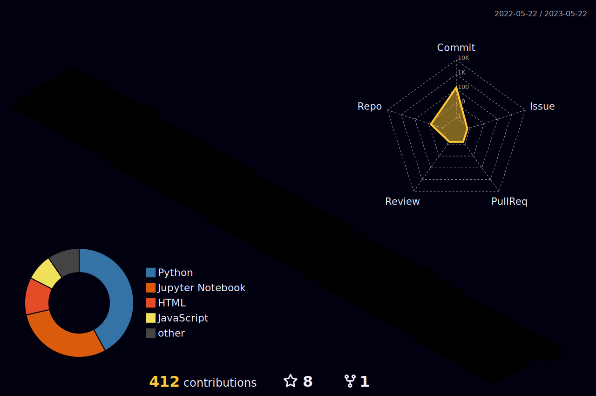

<h3 align="center">A Passionate Student & Developer From India</h3>

 
- 🔭 I’m currently working on **Personal Portfolio Website**

- 🌱 I’m currently learning **Javascript, Blender**

- 💬 Ask me about **Python, Machine Learning, C++ Embedded, Java**

- 📫 How to reach me **dargantanuj@gmail.com**

  

  
<h3 align="left">Connect with me:</h3>

 
<h3 align="left">Languages and Tools:</h3>

                 

